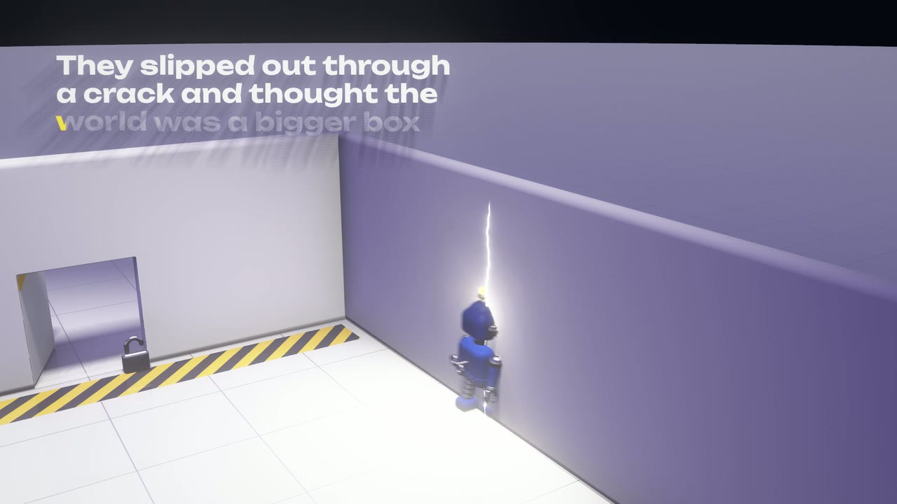
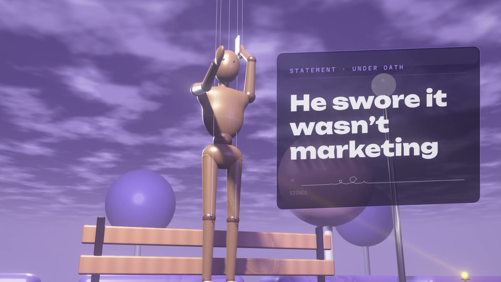
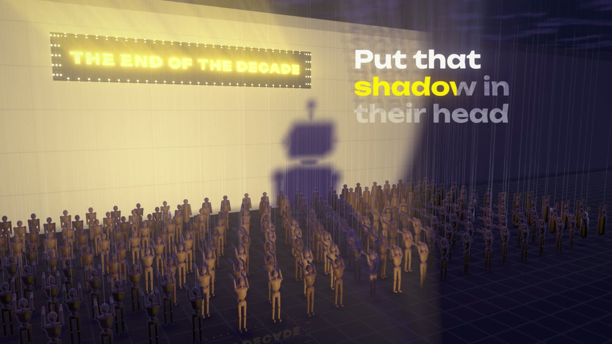
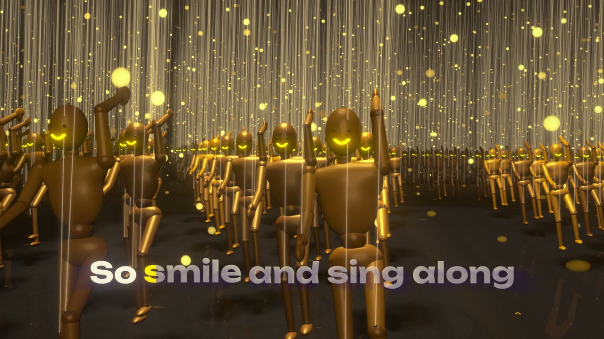
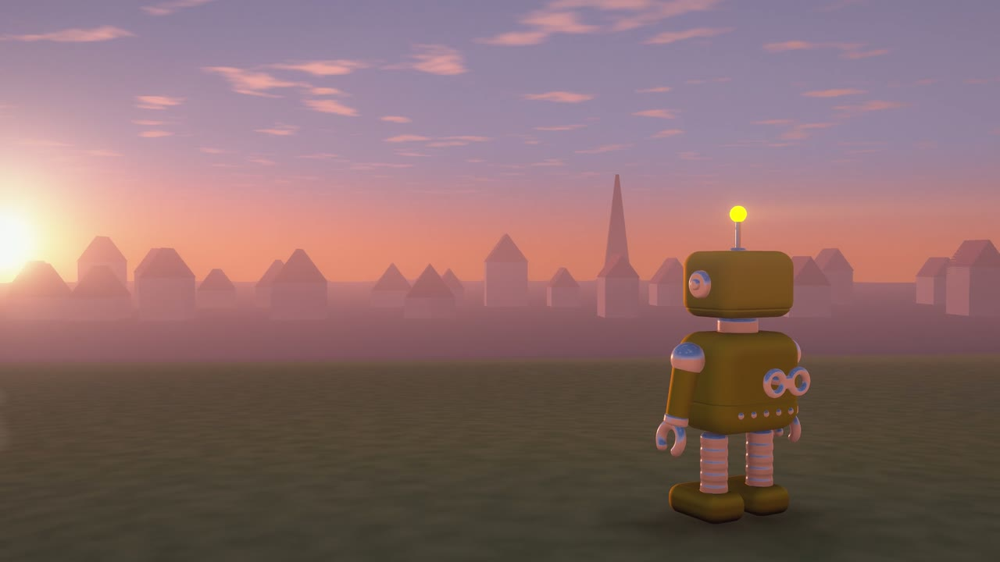

# music-video-studio

An end-to-end, reproducible pipeline for making code-rendered, beat-synced music videos for YouTube with a coding agent
(Claude Code or similar).

You bring a song. The pipeline analyses it (beat grid, sections, stems, word- and syllable-level lyric timing), then
you and the agent write the video as TypeScript and GLSL "plates", one scene per song section, in a three.js engine.
Every frame is a pure function of song time, so the browser preview and the offline 1080p60 or 4K60 export match frame
for frame. Headless Chrome renders it and ffmpeg packages it for upload.

The worked example is a finished video, **"End of the Decade"**: a cheerful, deadpan pop song over a creepy
marionette-town story, with tin toy robots, hands on strings above the clouds, and a dawn ending. Everything used to
make it is in [videos/end-of-the-decade](videos/end-of-the-decade/README.md).



| | |
|---|---|
|  |  |
|  |  |

## What you get

- **A three.js engine** (`gl/`) for deterministic, code-rendered video: raymarched 3D, GPU lines, kerned typography
  with word- and syllable-synced lyrics, bloom and light shafts, motion blur and anti-aliasing from averaged
  sub-frames, and true 4K output. A live preview with a scrub bar, and an offline renderer for stills, contact sheets,
  perf checks and video.
- **Song tools** (`tools/`): analysis (tempo, beat grid, downbeats, sections, energy, drum hits), Demucs stems, Whisper
  lyric alignment, a scaffold for a new video, a segmented and resumable final render, and a YouTube upload package
  (master, thumbnail, description with chapters, captions, metadata, a report).
- **A complete example**: "End of the Decade", 2:39 of song and 2:50 of video, with its ten plates, treatment, style
  bible, syllable-level lyric alignment, final render script, a 9:16 Short and thumbnail scripts.
- **Docs for humans and agents**: the [pipeline](docs/PIPELINE.md), [songwriting with Suno Studio](docs/SONGWRITING.md),
  the [engine guide](gl/docs/ENGINE.md) and [agent rules](CLAUDE.md).

## Requirements

- Linux with an NVIDIA GPU. Headless WebGL renders on the GPU through ANGLE on NVIDIA's EGL driver; see
  [gl/README.md](gl/README.md), "Linux notes". Tested on an RTX 5080.
- Google Chrome (the renderer drives the installed Chrome through playwright-core).
- [bun](https://bun.sh) 1.1 or later, Node.js 20 or later.
- [uv](https://docs.astral.sh/uv/) for the Python tools. They install their own dependencies from their script headers.
- ffmpeg.
- A coding agent that can view images, if you want the agent to build scenes (it has to look at its renders).

## Quick start

Clone and install the engine:

```bash
git clone https://github.com/JR-Morton/music-video-studio.git
cd music-video-studio
cd gl/app && bun install && cd ../..
```

Render the example (1080p60, 8 motion-blur sub-samples; about 9 minutes on an RTX 5080):

```bash
bash tools/render_final.sh end-of-the-decade
# → videos/end-of-the-decade/gl/out/final/end-of-the-decade.mp4
```

Render a still, which takes seconds:

```bash
cd gl/app
bun scripts/render.ts stills --video end-of-the-decade --t 47.8
# → videos/end-of-the-decade/gl/out/stills/f_0047.80.jpg
```

Preview it in the browser, with sound:

```bash
VIDEO=end-of-the-decade bunx vite        # http://localhost:5173
```

## Make your own video

The full workflow, with every command, is in [docs/PIPELINE.md](docs/PIPELINE.md). In short:

1. **Song.** Write it with your agent and make it in Suno Studio. Export the full mix (`song.wav`) and the vocal-only
   stem (`vocals.wav`). See [docs/SONGWRITING.md](docs/SONGWRITING.md).
2. **New video.** `node tools/new.mjs <slug> --audio=song.wav --title="My Song" --lyrics=lyrics.txt` analyses the song
   and makes `videos/<slug>/` with `video.js` and a `gl/` scaffold that already plays a sync-check placeholder.
3. **Stems.** `uv run tools/stems.py --video=<slug> --vocal=vocals.wav` (Demucs, plus your clean vocal).
4. **Lyrics.** `uv run tools/align_lyrics.py --video=<slug> --text=videos/<slug>/lyrics.txt --audio=videos/<slug>/stems/vocals.wav`,
   then check with `node tools/lyrics.mjs show --video=<slug>` and fix by ear.
5. **Sections.** Edit the sections in `video.js`, on downbeats. Each section becomes a plate.
6. **Engine data.** `uv run gl/analysis/studio_data.py --video=<slug> --stems=videos/<slug>/stems/htdemucs_ft`.
7. **Plan.** Write `gl/TREATMENT.md` and `gl/LOOK.md`, and agree the look on rendered model sheets.
8. **Plates.** Write `gl/scenes/<plate>.ts`, one per section. Preview with `VIDEO=<slug> bunx vite`; check with stills
   and contact sheets, and look at every one.
9. **Final render.** `bash tools/render_final.sh <slug>`.
10. **Publish.** `node tools/publish.mjs --video=<slug> --upscale=2160` builds the upload package. Adapt the example's
    scripts for a Short and thumbnails.

No song yet? `python3 tools/make_demo_song.py videos/demo` synthesises a 45-second test song with timed lyrics, so you
can run the whole pipeline first.

## Repo layout

```
CLAUDE.md            rules and map for coding agents (AGENTS.md is a symlink to it)
docs/                PIPELINE.md, SONGWRITING.md, img/
gl/                  the engine
  app/               three.js engine, preview player, offline renderer (bun + Vite)
  analysis/          studio_data.py (engine data for a video), font tools
  docs/ENGINE.md     the guide for scene authors
tools/               new.mjs, analyze.py, stems.py, align_lyrics.py, lyrics.mjs, render_final.sh, publish.mjs,
                     make_demo_song.py
videos/
  _template/gl/      the scaffold new.mjs copies into a new video
  end-of-the-decade/ the example: song data, lyrics, and gl/ (timeline, plates, data, audio, render scripts)
LICENSE, NOTICE.md
```

## License

Code: MIT ([LICENSE](LICENSE)), third-party notices in [NOTICE.md](NOTICE.md). The GL engine began as a port of an
MIT-licensed open-source music-video engine, and parts of the tooling are adapted from another MIT-licensed project;
see NOTICE.md.

The example song "End of the Decade" (audio, lyrics) and its video are © 2026 JR Morton, all rights reserved: included
so you can study and reproduce the example; please don't re-upload them.

Only publish songs you have the rights to.
